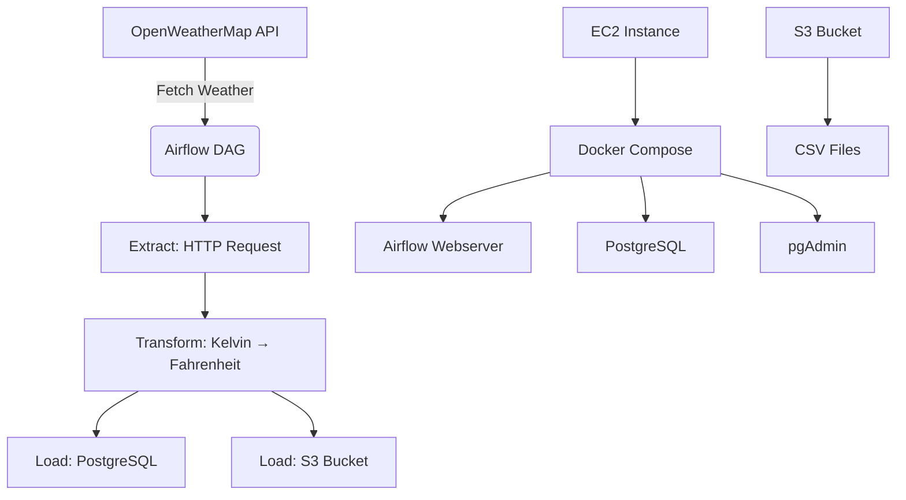

```markdown
# Weather Data Pipeline with Apache Airflow on AWS EC2

A fully automated **ETL pipeline** that fetches real-time weather data for **Portland, OR** from **OpenWeatherMap**, transforms temperature units, and loads the data into **PostgreSQL** and **Amazon S3** using **Apache Airflow** orchestrated via **Docker Compose** on an **AWS EC2 instance**.

---

## Project Architecture



---

## Features

- **Daily scheduled** weather data ingestion
- **Temperature conversion** from Kelvin to Fahrenheit
- **Dual sink loading**: PostgreSQL + S3 (CSV)
- **Airflow UI** for monitoring and debugging
- **pgAdmin** for database inspection
- **Dockerized** environment for consistency
- Hosted on **AWS EC2** with secure access

---

## Tech Stack

| Component             | Technology                          |
|-----------------------|-------------------------------------|
| Orchestration         | Apache Airflow 3.1.0                |
| Containerization      | Docker + Docker Compose             |
| Database              | PostgreSQL                          |
| Object Storage        | Amazon S3                           |
| Cloud Provider        | AWS EC2 (t2.xlarge)                 |
| API Source            | OpenWeatherMap                      |
| File Transfer         | WinSCP (optional)                   |
| UI Tools              | Airflow Web UI, pgAdmin             |

---

## Prerequisites

1. **AWS Account** with EC2 and S3 access
2. **OpenWeatherMap API Key** ([Signup here](https://openweathermap.org/))
3. **Domain knowledge**: Basic Linux, Docker, AWS
4. **Local Tools**:
   - SSH client
   - WinSCP (optional)
   - Web browser

---

## Setup Instructions

### 1. Launch EC2 Instance

- **Instance Type**: `t2.xlarge`
- **Storage**: 32 GB (recommended)
- **Security Group**:
  - Inbound Rules:
    - SSH (`22`) – Your IP
    - Custom TCP (`4000-38888`) – Your IP
    - HTTP (`8080`, `5050`) – Your IP (for Airflow & pgAdmin)

### 2. Connect to EC2

```bash
ssh -i "your-key.pem" ec2-user@<EC2-PUBLIC-DNS>
```

> Use port forwarding to access UIs locally:
```bash
ssh -i "your-key.pem" ec2-user@<EC2-PUBLIC-DNS> \
  -L 8080:localhost:8080 \
  -L 5050:localhost:5050 \
  -L 5433:localhost:5433 \
  -L 5555:localhost:5555
```

---

### 3. Copy Project Files to EC2

```bash
scp -r -i "your-key.pem" docker_exp ec2-user@<EC2-PUBLIC-DNS>:/home/ec2-user/
```

> Ensure your local folder `docker_exp` contains:
> - `docker-compose.yaml`
> - `Dockerfile`
> - `dags/weather_dag.py`
> - `.env` (optional)

---

### 4. Install Docker & Docker Compose

```bash
sudo yum update -y
sudo yum install docker -y
sudo systemctl start docker
sudo usermod -aG docker ec2-user

# Install Docker Compose
sudo curl -L "https://github.com/docker/compose/releases/download/1.29.1/docker-compose-$(uname -s)-$(uname -m)" -o /usr/local/bin/docker-compose
sudo chmod +x /usr/local/bin/docker-compose
```

---

### 5. Set Airflow UID

```bash
echo -e "AIRFLOW_UID=50000" > .env
```

---

### 6. Start Services

```bash
cd docker_exp
docker-compose up -d --build
```

> First run may take 5–10 minutes.

Check status:
```bash
docker ps
```

---

## Access Tools Locally

| Service         | URL                             | Credentials            |
|-----------------|----------------------------------|------------------------|
| **Airflow UI**  | `http://localhost:8080`         | `airflow` / `airflow` |
| **pgAdmin**     | `http://localhost:5050`         | `admin@admin.com` / `admin` |

---

## Database Setup

### Connect pgAdmin to PostgreSQL

1. Open pgAdmin → Add New Server
2. **General**:
   - Name: `Airflow Postgres`
3. **Connection**:
   - Host: `postgres`
   - Port: `5432`
   - Maintenance DB: `airflow`
   - Username: `airflow`
   - Password: `airflow`

### Create Table (Run in pgAdmin)

```sql
CREATE TABLE IF NOT EXISTS weather_data (
    id SERIAL PRIMARY KEY,
    city VARCHAR(50),
    description VARCHAR(100),
    temperature_f FLOAT,
    feels_like_f FLOAT,
    min_temp_f FLOAT,
    max_temp_f FLOAT,
    pressure INTEGER,
    humidity INTEGER,
    wind_speed FLOAT,
    time_of_record TIMESTAMP,
    sunrise TIMESTAMP,
    sunset TIMESTAMP
);
```

---

## Airflow Connections (Admin → Connections)

### 1. OpenWeatherMap API
- **Conn ID**: `weathermap_api`
- **Conn Type**: `HTTP`
- **Host**: `https://api.openweathermap.org`

### 2. PostgreSQL
- **Conn ID**: `postgres_default`
- **Conn Type**: `Postgres`
- **Host**: `postgres`
- **Schema**: `airflow`
- **Login**: `airflow`
- **Password**: `airflow`
- **Port**: `5432`

### 3. AWS S3 (Optional – if not using IAM Role)
- **Conn ID**: `aws_default`
- **Conn Type**: `Amazon Web Services`
- Fill AWS credentials or **attach IAM role to EC2**

> **Recommended**: Attach IAM Role with `AmazonS3FullAccess` to EC2

---

## DAG: `weather_dag`

- **Schedule**: `@daily`
- **Tasks**:
  1. `is_weather_api_ready` → Checks API availability
  2. `extract_weather_data` → Fetches JSON from OpenWeatherMap
  3. `transform_load_weather_data` → Converts temp, saves to **S3** and **PostgreSQL**

> DAG file: `dags/weather_dag.py`

---

## Output Locations

### S3 Bucket
```
s3://affan-openweather-project-s3/weather_data/
└── current_weather_data_portland_15012025123045.csv
```

### PostgreSQL Table
```sql
SELECT * FROM weather_data ORDER BY time_of_record DESC LIMIT 5;
```

---

## Project Structure

```
docker_exp/
├── dags/
│   └── weather_dag.py
├── Dockerfile
├── docker-compose.yaml
├── .env
└── logs/
```

---

## IAM Role for EC2 (Recommended)

1. Create IAM Role
2. Attach policies:
   - `AmazonS3FullAccess`
   - `AmazonEC2FullAccess` (or minimal permissions)
3. Attach role to EC2 instance via **Actions → Security → Modify IAM Role**

---

## Troubleshooting

| Issue                                | Solution |
|--------------------------------------|---------|
| Airflow not accessible               | Check `docker ps`, port forwarding |
| DAG not appearing                    | Wait 1–2 mins, refresh, check `dags/` folder permissions |
| S3 access denied                     | Verify IAM role or `aws_default` connection |
| PostgreSQL connection failed         | Ensure `postgres` container is healthy |
| API 401 error                        | Replace API key in DAG |

---

## Cleanup

```bash
docker-compose down
sudo systemctl stop docker
```

> To remove volumes:
```bash
docker-compose down -v
```

---

## Future Enhancements

- [ ] Add multiple cities
- [ ] Email/Slack alerts on failure
- [ ] Visualize data with Superset/Tableau
- [ ] Use Athena + QuickSight for analytics
- [ ] CI/CD with GitHub Actions

---

## Author

**Affan**  
*Built with ❤️ using Airflow, AWS, and Open Data*

---